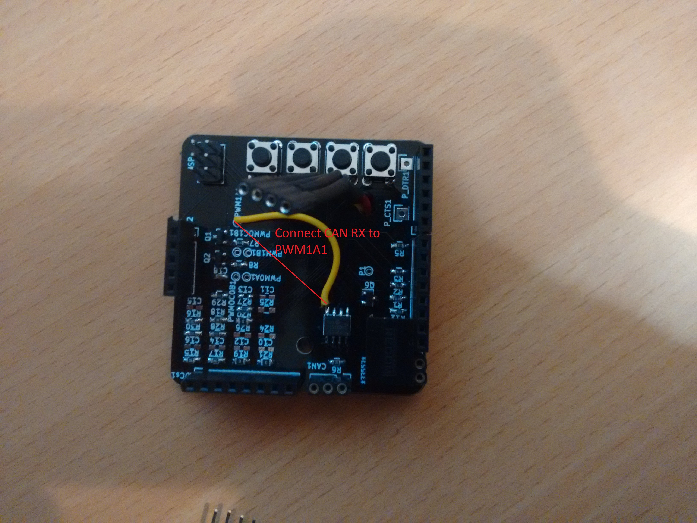
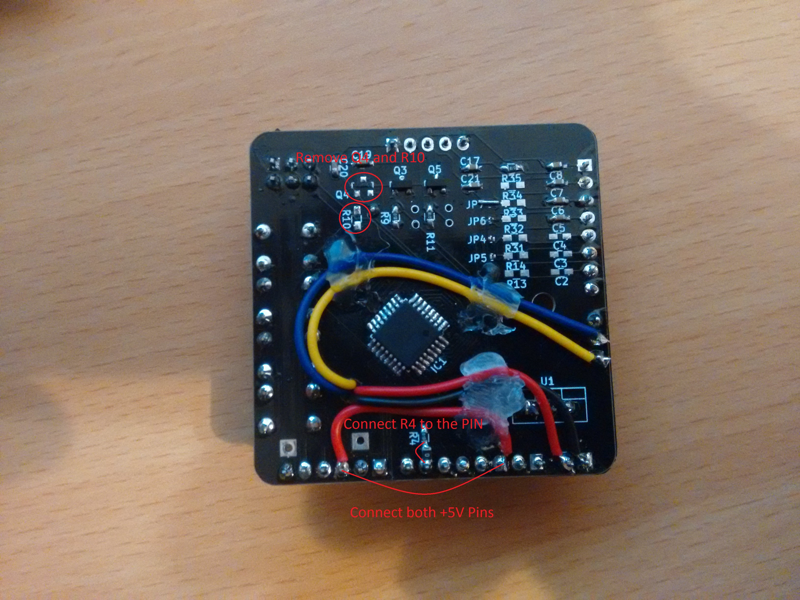

# Errata to the Schematics

Schematics from commit adee088dd9ad20461ed7a09ecef526a60e1ee473
* Important fix: 
  connect +5VPin from Display IC3-PIN3 to +5VPin from FTDI IC2-PIN3. 
  no fixed board yet
* other fixes:  
  for Display Operation connect R4 to Display CS IC3-PIN7. 
  no fixed board yet
* for Wakeup:  
  remove Q4 and R10. Connect RXCAN of MCP2551 U2-PIN4 to PWM1A1. 
  no fixed schematics yet 
  no fixed board yet 
  
The fixes are marked on the Pictures below:

